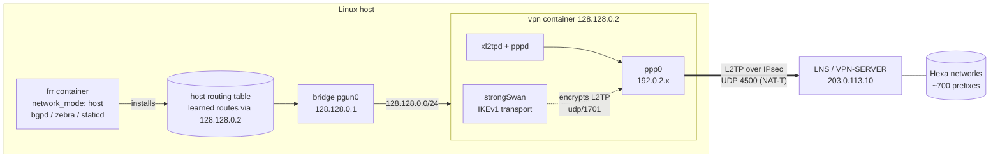
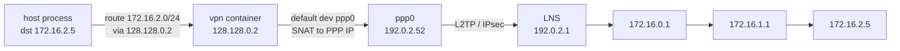
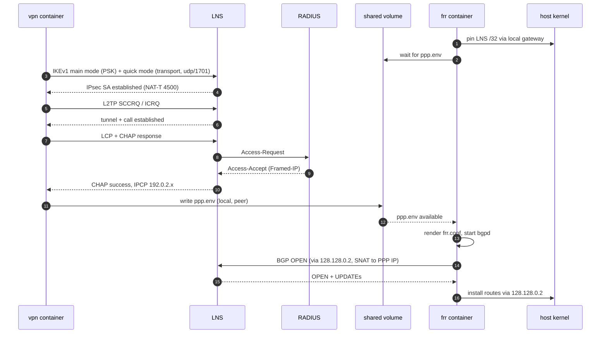
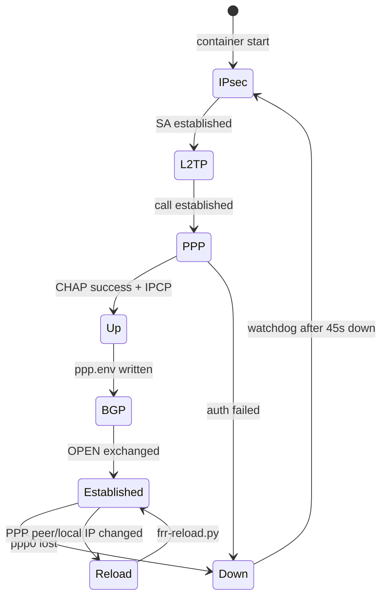
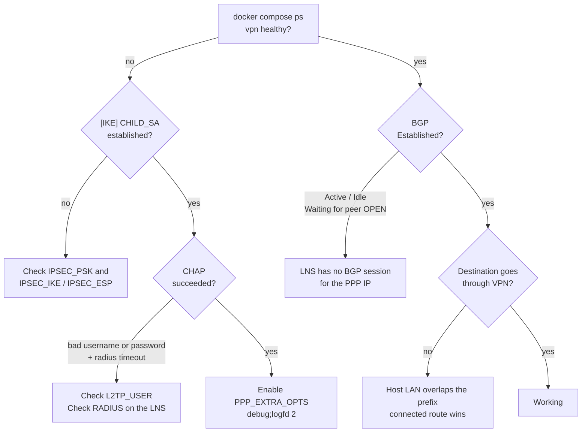

# portal-gun

> L2TP/IPsec tunnel to the Hexa LNS (VPN-SERVER) with a BGP session inside it, packaged as two Docker containers. Routes learned over BGP are installed in the **host** routing table and forwarded through the tunnel.

---

## TL;DR

```bash
git clone https://github.com/Hexa-Networks/portal-gun.git && cd portal-gun
./start.sh                                                   # asks for credentials, writes .env, starts everything
docker exec -it portal-gun-frr vtysh -c 'show bgp summary'   # expect: Established + prefixes received
ip route | grep 128.128.0.2                                  # learned routes on the host
```

- **Container `vpn`:** strongSwan + xl2tpd + pppd. It brings up the tunnel and forwards everything it receives into `ppp0`.
- **Container `frr`:** FRR in the host network namespace. It runs iBGP AS 65000 with the PPP peer and installs the routes in the host with next-hop `128.128.0.2`.
- **Transit network:** the two containers talk over `128.128.0.0/24`. The host/FRR side is `.1` and the `vpn` container is `.2`.
- **LNS side:** each client MUST have a RADIUS user with a fixed IP and a BGP session configured for that IP.

---

## Conventions

The key words **MUST**, **MUST NOT**, **REQUIRED**, **SHALL**, **SHALL NOT**, **SHOULD**, **SHOULD NOT**, **RECOMMENDED**, **MAY** and **OPTIONAL** in this document are to be interpreted as described in [RFC 2119](https://www.rfc-editor.org/rfc/rfc2119).

This document follows the **5W2H** structure: What, Why, Who, Where, When, How, How much.

---

## 1. What

portal-gun is a Docker Compose project that:

1. Establishes an **IPsec** security association with the LNS. It uses IKEv1, transport mode, a pre-shared key and NAT-T.
2. Brings up an **L2TP** tunnel and a **PPP** session inside that IPsec SA. The session is authenticated with CHAP against the LNS RADIUS.
3. Opens an **iBGP** session with the PPP peer over the tunnel.
4. Installs every accepted BGP route in the **host kernel**, so the host and anything routed through it reach those networks via the VPN.



---

## 2. Why

- **Reach internal networks from any Linux host** without installing VPN or routing software directly on the host.
- **Get dynamic routes** instead of static ones. The LNS announces the networks over BGP, and changes on the LNS side reach the host automatically.
- **Keep internet traffic local.** Only the prefixes learned over BGP go through the tunnel, and the default route from the LNS is rejected by default.
- **Be reproducible.** A single `./start.sh` gives the same setup on every machine. This replaces the manual tutorial: NetworkManager VPN, then installing FRR, then configuring `vtysh` by hand.

---

## 3. Who

| Role | Responsibility |
|---|---|
| **NOC / network team** | MUST create the client RADIUS user with a fixed `Framed-IP-Address` and the matching BGP session on the LNS. |
| **Operator of the client host** | MUST provide the credentials when running `./start.sh` and MUST be a member of the `docker` group. |
| **`vpn` container** | Owns IPsec, L2TP, PPP, NAT and the reconnect watchdog. |
| **`frr` container** | Owns the BGP session, route filtering and route installation in the host. |

---

## 4. Where

### 4.1 Addressing

| Element | Address | Notes |
|---|---|---|
| LNS public IP | `203.0.113.10` | Pinned on the host via the local default gateway to avoid routing loops. |
| Transit subnet | `128.128.0.0/24` | Docker bridge `pgun0`. |
| Host / FRR | `128.128.0.1` | Bridge gateway. FRR listens here because it runs in the host namespace. |
| `vpn` container | `128.128.0.2` | Next-hop for every learned route. |
| PPP local | `192.0.2.x` | Fixed per user by RADIUS. Used as the BGP router-id and as the NAT source. |
| PPP peer / BGP neighbor | `192.0.2.1` | Auto-detected from the PPP session (`BGP_NEIGHBOR=auto`). |

### 4.2 Packet path



Verified with traceroute:

```
1  128.128.0.2      vpn container (transit)
2  192.0.2.1    LNS (inside the tunnel)
3  172.16.0.1
4  172.16.1.1
```

### 4.3 Repository layout

```
portal-gun/
├── docker-compose.yml   # services, transit network, shared volume
├── start.sh             # credential dialog + docker compose up
├── .env.example         # every option, with defaults
├── vpn/
│   ├── Dockerfile
│   ├── entrypoint.sh    # strongSwan, xl2tpd, NAT, watchdog
│   ├── ip-up            # PPP up: routes + shared state
│   └── ip-down          # PPP down: restore routes
└── frr/
    ├── Dockerfile
    ├── entrypoint.sh    # waits for PPP, renders config, reloads on change
    └── render.sh        # generates frr.conf
```

---

## 5. When

### 5.1 Bring-up sequence



### 5.2 Lifecycle and recovery



- The `vpn` watchdog **SHALL** retry the connection about every 50 seconds while `ppp0` is down. It does not retry faster, to protect the RADIUS server from bursts of authentication attempts.
- Both containers **SHALL** restart automatically (`restart: unless-stopped`), including after a host reboot.
- If the PPP addresses change, the `frr` container **SHALL** re-render and reload its configuration without a restart.

---

## 6. How

### 6.1 Requirements

**Host**

- The host **MUST** run Linux with the kernel modules `ppp_generic`, `l2tp_ppp`, `esp4` and `xfrm_user` available. The `vpn` container loads them itself through `/lib/modules`.
- The host **MUST** have Docker Engine with the Compose v2 plugin.
- The operator **MUST** be in the `docker` group: `usermod -aG docker <user>`, then log out and back in.
- The host **MUST NOT** run another IKE daemon on UDP 500/4500.
- The host LAN **SHOULD NOT** overlap any prefix announced by the LNS. See [Limitations](#9-limitations).
- The host **MUST NOT** use `128.128.0.0/24` for anything else, or **MUST** change `TRANSIT_*` in `.env`.

**LNS (VPN-SERVER)**

- The RADIUS user **MUST** have a fixed `Framed-IP-Address`.
- The LNS **MUST** have a BGP session to that IP with remote AS `65000`, or the value set in `BGP_LOCAL_AS`.
- The LNS **SHOULD** use a RADIUS timeout long enough for its RADIUS server. With the RouterOS default of 300 ms the LNS can answer `radius timeout`.

### 6.2 Install and run

```bash
git clone https://github.com/Hexa-Networks/portal-gun.git
cd portal-gun
./start.sh            # whiptail dialog: LNS IP, user, password, PSK, ASNs
./start.sh --reconfig # ask everything again
```

- `start.sh` **SHALL** write `.env` with mode `600`.
- `.env` **MUST NOT** be committed. It is listed in `.gitignore`.

### 6.3 Operate

```bash
docker compose ps                                            # vpn MUST become "healthy"
docker compose logs -f vpn                                   # [IKE] / xl2tpd / pppd / [vpn]
docker compose logs -f frr                                   # [frr] + FRR logs
docker exec -it portal-gun-frr vtysh -c 'show bgp summary'
docker exec -it portal-gun-frr vtysh -c 'show ip route bgp'
ip route | grep -c 'via 128.128.0.2'                         # number of learned routes
docker compose down                                          # stop
docker compose up -d                                         # start
```

### 6.4 Configuration reference

All options live in `.env` (template: `.env.example`).

| Variable | Default | Level | Description |
|---|---|---|---|
| `LNS_IP` | `203.0.113.10` | REQUIRED | LNS public address |
| `IPSEC_PSK` | — | REQUIRED | IPsec pre-shared key |
| `L2TP_USER` / `L2TP_PASS` | — | REQUIRED | PPP credentials (CHAP) |
| `IPSEC_IKE` / `IPSEC_ESP` | AES/SHA1/MODP set | OPTIONAL | IKEv1 phase 1 / phase 2 proposals |
| `PPP_MTU` | `1400` | OPTIONAL | PPP MTU/MRU. TCP MSS is clamped to PMTU. |
| `PPP_EXTRA_OPTS` | empty | OPTIONAL | Extra pppd options separated by `;` (e.g. `debug;logfd 2`) |
| `TRANSIT_SUBNET` | `128.128.0.0/24` | OPTIONAL | Transit network |
| `TRANSIT_HOST_IP` | `128.128.0.1` | OPTIONAL | Host / FRR side |
| `TRANSIT_VPN_IP` | `128.128.0.2` | OPTIONAL | `vpn` container and next-hop of learned routes |
| `BGP_LOCAL_AS` / `BGP_REMOTE_AS` | `65000` / `65000` | OPTIONAL | Different values enable eBGP with `ebgp-multihop 3` |
| `BGP_NEIGHBOR` | `auto` | OPTIONAL | `auto` = PPP peer address |
| `BGP_ROUTER_ID` | `auto` | OPTIONAL | `auto` = PPP local address |
| `BGP_NETWORKS` | empty | OPTIONAL | Space-separated prefixes announced to the LNS. They are forwarded without NAT. |
| `BGP_ACCEPT_DEFAULT` | `no` | OPTIONAL | Accept `0.0.0.0/0` from the LNS |

### 6.5 Routing policy

| Direction | Rule |
|---|---|
| Inbound | **MUST** reject `0.0.0.0/0` unless `BGP_ACCEPT_DEFAULT=yes` |
| Inbound | **MUST** reject anything inside `TRANSIT_SUBNET` |
| Inbound | **MUST** reject the LNS `/32` (loop protection) |
| Inbound | Every other route is accepted with next-hop rewritten to `128.128.0.2` |
| Outbound | Only `BGP_NETWORKS` is announced. With an empty list, nothing is announced. |

### 6.6 Troubleshooting



| Symptom | Cause | Fix |
|---|---|---|
| `NO_PROPOSAL_CHOSEN` / `AUTHENTICATION_FAILED` in `[IKE]` | Wrong PSK or incompatible proposals | `IPSEC_PSK`, `IPSEC_IKE`, `IPSEC_ESP` |
| `CHAP authentication failed` + `radius timeout` | Wrong user, or the RADIUS server is not answering the LNS | Check the user; check `/radius monitor` on the LNS |
| BGP `Active`/`Idle`, `Waiting for peer OPEN` | The LNS accepts TCP/179 and then closes it, because no session exists for the client IP | Create the BGP session on the LNS |
| BGP up, but one destination bypasses the VPN | The host LAN covers that destination | See [Limitations](#9-limitations) |

---

## 7. How much

| Item | Cost |
|---|---|
| Licensing | None. strongSwan, xl2tpd, ppp and FRR are open source. |
| Images | `vpn` ≈ 98 MB, `frr` ≈ 148 MB (Debian bookworm-slim) |
| Memory at runtime | `vpn` ≈ 7 MiB, `frr` ≈ 88 MiB with ~710 prefixes |
| CPU | Negligible at idle; the data plane is in-kernel (xfrm + l2tp_ppp) |
| Per-packet overhead | About 60–80 bytes (ESP + NAT-T + L2TP + PPP). The PPP MTU is 1400 and TCP MSS is clamped. |
| Setup time | About 1 minute per host once the LNS side is provisioned |
| RADIUS load | At most one authentication attempt about every 50 s per client while the tunnel is down |

---

## 8. Security

- Credentials **MUST** only live in `.env` (mode `600`). They **MUST NOT** be committed or pasted into tickets or chats.
- The PSK and the password **MUST NOT** contain quotes (`'` or `"`).
- The `vpn` container runs `privileged`. It needs `/dev/ppp`, kernel modules, xfrm and iptables. The host **SHOULD** be dedicated or trusted.
- The `frr` container shares the host network namespace and can change host routes, but only the routes it installs itself.

---

## 9. Limitations

- **LAN overlap.** If the host LAN overlaps a prefix announced by the LNS, the connected route wins and that range is reached through the LAN, not the VPN. For example, a host in `192.168.10.0/24` cannot reach `192.168.10.x` through the VPN, even though `192.168.0.0/16` is learned. Production hosts **SHOULD** use LANs that do not collide with the LNS prefixes.
- **No TCP-MD5 for BGP.** The session is NATed inside the `vpn` container, so TCP-MD5 authentication (BGP password) cannot be used.
- **IPv4 only.** IPv6 over the tunnel is not configured.
- **One LNS per stack.** To connect to several LNSs, run one copy of the project per LNS, each with its own `TRANSIT_*` and project name.
