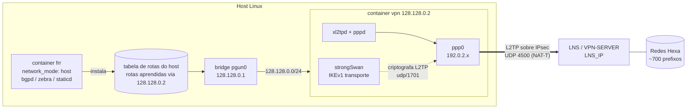
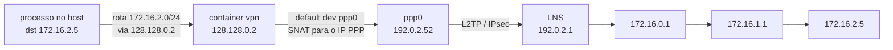
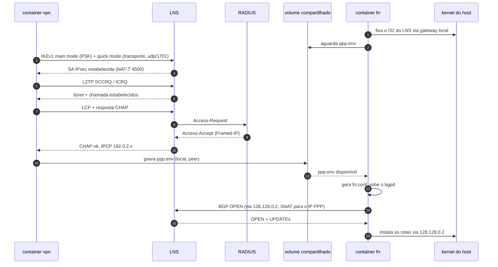
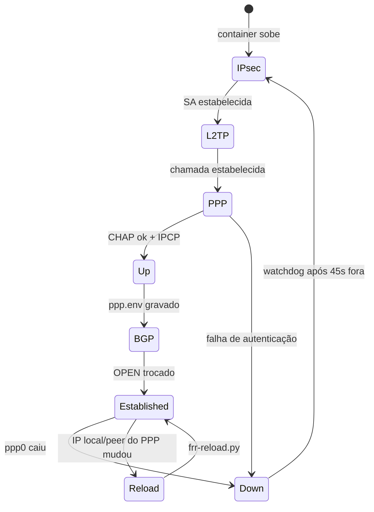
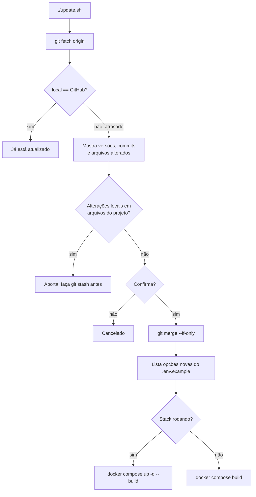
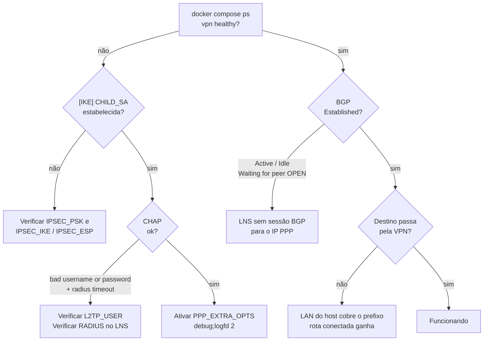
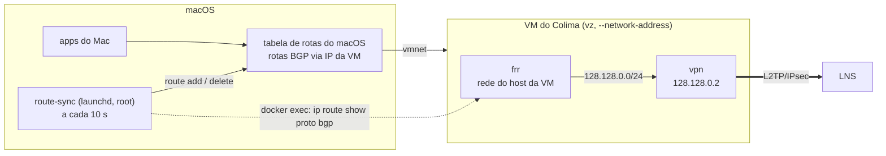
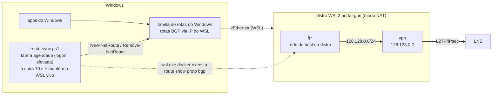

# portal-gun

> 🇺🇸 [English version](../README.md)

> Túnel L2TP/IPsec até o LNS da Hexa (VPN-SERVER) com uma sessão BGP por dentro, empacotado em dois containers Docker. As rotas aprendidas via BGP são instaladas na tabela de rotas do **host** e encaminhadas pelo túnel.

---

## TL;DR

```bash
git clone https://github.com/Hexa-Networks/portal-gun.git && cd portal-gun
./start.sh                                                   # pergunta as credenciais, grava o .env e sobe tudo
su -c ./install.sh                                           # (root) sobe automaticamente no boot
./update.sh                                                  # compara com o GitHub e atualiza
docker exec -it portal-gun-frr vtysh -c 'show bgp summary'   # esperado: Established + prefixos recebidos
ip route | grep 128.128.0.2                                  # rotas aprendidas no host
```

No macOS: `./macos/setup.sh` (veja [6.9 macOS](#69-macos)). No Windows: `.\windows\setup.ps1` (feature de teste, veja [6.10 Windows](#610-windows-feature-de-teste)).

- **Container `vpn`:** strongSwan + xl2tpd + pppd. Sobe o túnel e encaminha para o `ppp0` tudo o que recebe.
- **Container `frr`:** FRR no namespace de rede do host. Fecha iBGP AS 65000 com o peer PPP e instala as rotas no host com next-hop `128.128.0.2`.
- **Rede de trânsito:** os dois containers se falam pela `128.128.0.0/24`. O lado host/FRR é o `.1` e o container `vpn` é o `.2`.
- **Lado do LNS:** cada cliente DEVE (MUST) ter um usuário no RADIUS com IP fixo e uma sessão BGP configurada para esse IP.

---

## Convenções

As palavras-chave **MUST**, **MUST NOT**, **REQUIRED**, **SHALL**, **SHALL NOT**, **SHOULD**, **SHOULD NOT**, **RECOMMENDED**, **MAY** e **OPTIONAL** neste documento devem ser interpretadas conforme a [RFC 2119](https://www.rfc-editor.org/rfc/rfc2119). Elas são mantidas em inglês para preservar o significado normativo.

| Termo | Significado |
|---|---|
| **MUST** / **REQUIRED** / **SHALL** | obrigatório |
| **MUST NOT** / **SHALL NOT** | proibido |
| **SHOULD** / **RECOMMENDED** | recomendado; só ignore com um motivo claro |
| **SHOULD NOT** | não recomendado |
| **MAY** / **OPTIONAL** | opcional |

Este documento segue a estrutura **5W2H**: O quê (What), Por quê (Why), Quem (Who), Onde (Where), Quando (When), Como (How) e Quanto custa (How much).

---

## 1. O quê (What)

O portal-gun é um projeto Docker Compose que:

1. Estabelece uma associação de segurança **IPsec** com o LNS, usando IKEv1, modo transporte, chave pré-compartilhada e NAT-T.
2. Sobe um túnel **L2TP** e uma sessão **PPP** dentro dessa SA IPsec. A sessão é autenticada via CHAP no RADIUS do LNS.
3. Abre uma sessão **iBGP** com o peer PPP pelo túnel.
4. Instala todas as rotas BGP aceitas no **kernel do host**. Assim o host, e o que for roteado por ele, alcança essas redes pela VPN.



---

## 2. Por quê (Why)

- **Acessar redes internas a partir de qualquer host Linux** sem instalar software de VPN ou de roteamento direto no host.
- **Ter rotas dinâmicas** em vez de rotas estáticas. O LNS anuncia as redes via BGP, e mudanças do lado do LNS chegam ao host automaticamente.
- **Manter o tráfego de internet local.** Só os prefixos aprendidos via BGP passam pelo túnel, e a rota default vinda do LNS é recusada por padrão.
- **Ser reprodutível.** Um único `./start.sh` gera a mesma configuração em qualquer máquina. Isso substitui o tutorial manual: VPN no NetworkManager, depois instalar o FRR, depois configurar o `vtysh` na mão.

---

## 3. Quem (Who)

| Papel | Responsabilidade |
|---|---|
| **NOC / time de redes** | MUST criar o usuário do cliente no RADIUS com `Framed-IP-Address` fixo e a sessão BGP correspondente no LNS. |
| **Operador do host cliente** | MUST informar as credenciais ao rodar o `./start.sh` e MUST estar no grupo `docker`. |
| **Container `vpn`** | Responsável pelo IPsec, L2TP, PPP, NAT e pelo watchdog de reconexão. |
| **Container `frr`** | Responsável pela sessão BGP, pelo filtro de rotas e pela instalação das rotas no host. |

---

## 4. Onde (Where)

### 4.1 Endereçamento

| Elemento | Endereço | Observações |
|---|---|---|
| IP público do LNS | `LNS_IP` (do `.env`) | Fixado no host via o gateway padrão local, para evitar loop de roteamento. |
| Rede de trânsito | `128.128.0.0/24` | Bridge Docker `pgun0`. |
| Host / FRR | `128.128.0.1` | Gateway da bridge. O FRR escuta aqui porque roda no namespace do host. |
| Container `vpn` | `128.128.0.2` | Next-hop de todas as rotas aprendidas. |
| IP PPP local | `192.0.2.x` | Fixo por usuário no RADIUS. Usado como router-id do BGP e como origem do NAT. |
| Peer PPP / vizinho BGP | `192.0.2.1` | Detectado automaticamente a partir da sessão PPP (`BGP_NEIGHBOR=auto`). |

### 4.2 Caminho do pacote



Exemplo de traceroute (endereços ilustrativos):

```
1  128.128.0.2      container vpn (trânsito)
2  192.0.2.1    LNS (dentro do túnel)
3  172.16.0.1
4  172.16.1.1
```

### 4.3 Estrutura do repositório

```
portal-gun/
├── docker-compose.yml   # serviços, rede de trânsito, volume compartilhado
├── start.sh             # dialog de credenciais + docker compose up
├── update.sh            # compara com o GitHub, mostra as mudanças, atualiza + rebuild
├── install.sh           # (root) unidade systemd: sobe no boot
├── .env.example         # todas as opções, com valores padrão
├── docs/
│   └── README.pt-BR.md  # este documento
├── macos/               # variante macOS: setup, route-sync, uninstall
├── windows/             # variante Windows (WSL2, feature de teste): setup, route-sync, diag, update, uninstall
├── vpn/
│   ├── Dockerfile
│   ├── entrypoint.sh    # strongSwan, xl2tpd, NAT, watchdog
│   ├── ip-up            # PPP up: rotas + estado compartilhado
│   └── ip-down          # PPP down: restaura as rotas
└── frr/
    ├── Dockerfile
    ├── entrypoint.sh    # espera o PPP, gera a config, recarrega se mudar
    └── render.sh        # gera o frr.conf
```

---

## 5. Quando (When)

### 5.1 Sequência de subida



### 5.2 Ciclo de vida e recuperação



- O watchdog do `vpn` **SHALL** tentar reconectar a cada ~50 segundos enquanto o `ppp0` estiver fora. Ele não tenta mais rápido que isso, para não sobrecarregar o RADIUS com tentativas de autenticação.
- Depois de rodar o `install.sh`, a stack **SHALL** subir no boot pela unidade systemd `portal-gun.service`, mesmo depois de um `docker compose down`. Durante a execução, os dois containers **SHALL** reiniciar sozinhos se caírem (`restart: unless-stopped`).
- Se os endereços PPP mudarem, o container `frr` **SHALL** gerar a configuração de novo e recarregá-la sem reiniciar.

---

## 6. Como (How)

### 6.1 Requisitos

**Host**

- O host **MUST** rodar Linux com os módulos de kernel `ppp_generic`, `l2tp_ppp`, `esp4` e `xfrm_user` disponíveis. O container `vpn` carrega esses módulos sozinho, montando `/lib/modules`.
- O host **MUST** ter Docker Engine com o plugin Compose v2.
- O operador **MUST** estar no grupo `docker`: `usermod -aG docker <usuario>`, depois logout e login.
- O host **MUST NOT** rodar outro daemon IKE nas portas UDP 500/4500.
- A LAN do host **SHOULD NOT** coincidir com nenhum prefixo anunciado pelo LNS. Veja [Limitações](#9-limitações).
- O host **MUST NOT** usar a `128.128.0.0/24` para outra coisa, ou **MUST** alterar as variáveis `TRANSIT_*` no `.env`.

**LNS (VPN-SERVER)**

- O usuário no RADIUS **MUST** ter `Framed-IP-Address` fixo.
- O LNS **MUST** ter uma sessão BGP para esse IP com AS remoto `65000`, ou o valor definido em `BGP_LOCAL_AS`.
- O LNS **SHOULD** usar um timeout de RADIUS adequado ao servidor RADIUS. Com o padrão do RouterOS (300 ms), o LNS pode responder `radius timeout`.

### 6.2 Instalação e execução

```bash
git clone https://github.com/Hexa-Networks/portal-gun.git
cd portal-gun
./start.sh            # dialog whiptail: IP do LNS, usuário, senha, PSK, ASNs
./start.sh --reconfig # pergunta tudo de novo
```

- O `start.sh` **SHALL** gravar o `.env` com permissão `600`.
- O `.env` **MUST NOT** ser commitado. Ele está no `.gitignore`.

### 6.3 Subir no boot

```bash
su -c ./install.sh               # ou: sudo ./install.sh
systemctl status portal-gun      # active (exited) = stack no ar
su -c './install.sh --uninstall' # remove a unidade (mantém o projeto e o .env)
```

- O `install.sh` **MUST** ser rodado como root. Ele **SHALL**:
  - criar o `/etc/systemd/system/portal-gun.service`, que roda `docker compose up -d` no boot e `docker compose down` no desligamento;
  - habilitar o `docker.service`;
  - carregar os módulos de kernel no boot, via `/etc/modules-load.d/portal-gun.conf`.
- A unidade aponta para o diretório de onde o `install.sh` foi rodado. Se o projeto mudar de lugar, o `install.sh` **MUST** ser rodado de novo.
- O `.env` **SHOULD** existir antes do serviço subir (rode o `./start.sh` antes).

### 6.4 Atualização

```bash
./update.sh           # mostra a versão instalada vs GitHub + mudanças, pergunta e atualiza
./update.sh --check   # só verifica; exit 0 = atualizado, 10 = há atualização
./update.sh -y        # atualiza sem perguntar (ex.: automação)
```



- O `update.sh` **SHALL NOT** mexer no `.env`. Opções novas do `.env.example` são listadas e usam o valor padrão até serem adicionadas ao `.env`.
- O `update.sh` **SHALL** abortar se houver arquivos do projeto alterados localmente, ou se o histórico local e o remoto divergirem.
- Numa atualização com a stack rodando, a VPN **SHALL** reconectar, o que leva cerca de 30 s.
- O `start.sh` **SHALL** avisar quando houver versão nova.
- O host **MUST** conseguir ler o repositório no GitHub. Ele é privado, então autentique com `gh auth login` ou use uma deploy key.

**Publicar uma versão nova (mantenedores):** faça o commit, crie a tag e envie:

```bash
git tag -a v1.1.0 -m "descrição curta" && git push && git push --tags
```

O `update.sh` mostra as tags como versão (por exemplo, `v1.0.0` → `v1.1.0`).

### 6.5 Operação

```bash
docker compose ps                                            # o vpn MUST ficar "healthy"
docker compose logs -f vpn                                   # [IKE] / xl2tpd / pppd / [vpn]
docker compose logs -f frr                                   # [frr] + logs do FRR
docker exec -it portal-gun-frr vtysh -c 'show bgp summary'
docker exec -it portal-gun-frr vtysh -c 'show ip route bgp'
ip route | grep -c 'via 128.128.0.2'                         # quantidade de rotas aprendidas
systemctl stop portal-gun                                    # parar (root; ou: docker compose down)
systemctl start portal-gun                                   # subir (root; ou: docker compose up -d)
```

### 6.6 Referência de configuração

Todas as opções ficam no `.env` (modelo: `.env.example`).

| Variável | Padrão | Nível | Descrição |
|---|---|---|---|
| `LNS_IP` | — | REQUIRED | IP público do LNS (peça ao NOC) |
| `IPSEC_PSK` | — | REQUIRED | Chave pré-compartilhada do IPsec |
| `L2TP_USER` / `L2TP_PASS` | — | REQUIRED | Credenciais PPP (CHAP) |
| `IPSEC_IKE` / `IPSEC_ESP` | conjunto AES/SHA1/MODP | OPTIONAL | Propostas IKEv1 de fase 1 / fase 2 |
| `PPP_MTU` | `1400` | OPTIONAL | MTU/MRU do PPP. O MSS TCP é ajustado ao PMTU. |
| `PPP_EXTRA_OPTS` | vazio | OPTIONAL | Opções extras do pppd separadas por `;` (ex.: `debug;logfd 2`) |
| `TRANSIT_SUBNET` | `128.128.0.0/24` | OPTIONAL | Rede de trânsito |
| `TRANSIT_HOST_IP` | `128.128.0.1` | OPTIONAL | Lado host / FRR |
| `TRANSIT_VPN_IP` | `128.128.0.2` | OPTIONAL | Container `vpn` e next-hop das rotas aprendidas |
| `BGP_LOCAL_AS` / `BGP_REMOTE_AS` | `65000` / `65000` | OPTIONAL | Valores diferentes ativam eBGP com `ebgp-multihop 3` |
| `BGP_NEIGHBOR` | `auto` | OPTIONAL | `auto` = IP do peer PPP |
| `BGP_ROUTER_ID` | `auto` | OPTIONAL | `auto` = IP local do PPP |
| `BGP_NETWORKS` | vazio | OPTIONAL | Prefixos anunciados ao LNS, separados por espaço. Passam pelo túnel sem NAT. |
| `BGP_ACCEPT_DEFAULT` | `no` | OPTIONAL | Aceitar `0.0.0.0/0` vindo do LNS |
| `ALLOW_FORWARD` | `no` | OPTIONAL | Libera tráfego roteado de outras máquinas (ou do Mac, via Colima) para a VPN. O `macos/setup.sh` define como `yes`. |

### 6.7 Política de rotas

| Sentido | Regra |
|---|---|
| Entrada | **MUST** recusar `0.0.0.0/0`, a menos que `BGP_ACCEPT_DEFAULT=yes` |
| Entrada | **MUST** recusar qualquer prefixo dentro de `TRANSIT_SUBNET` |
| Entrada | **MUST** recusar o `/32` do LNS (proteção contra loop) |
| Entrada | Todas as outras rotas são aceitas, com next-hop reescrito para `128.128.0.2` |
| Saída | Só o que está em `BGP_NETWORKS` é anunciado. Com a lista vazia, nada é anunciado. |

### 6.8 Diagnóstico



| Sintoma | Causa | Correção |
|---|---|---|
| `NO_PROPOSAL_CHOSEN` / `AUTHENTICATION_FAILED` no `[IKE]` | PSK errada ou propostas incompatíveis | `IPSEC_PSK`, `IPSEC_IKE`, `IPSEC_ESP` |
| `CHAP authentication failed` + `radius timeout` | Usuário errado ou RADIUS sem responder ao LNS | Verificar o usuário; ver `/radius monitor` no LNS |
| BGP `Active`/`Idle` com `Waiting for peer OPEN` | O LNS aceita o TCP/179 e fecha, porque não existe sessão para o IP do cliente | Criar a sessão BGP no LNS |
| BGP no ar, mas um destino não passa pela VPN | A LAN do host cobre esse destino | Veja [Limitações](#9-limitações) |

### 6.9 macOS

> Testado em: MacBook Pro Apple Silicon, macOS 26 (Tahoe), Colima 0.10.3, Docker 29.5. VPN, BGP (~709 prefixos), sincronização de rotas e tráfego validados de ponta a ponta.

No macOS, o Docker roda dentro de uma VM Linux. Os containers são os mesmos, mas duas coisas mudam:

- O "host" do `network_mode: host` é a VM, então as rotas BGP vão para a tabela de rotas da **VM**, não do Mac.
- Os módulos de kernel L2TP/PPP **MUST** existir no kernel da VM.

A variante para macOS resolve as duas coisas com o [Colima](https://github.com/abiosoft/colima) e um serviço de sincronização de rotas:



**Requisitos**

- O Mac **MUST** rodar macOS 13 ou mais novo e ter o [Homebrew](https://brew.sh) instalado. O usuário **MUST** ser administrador.
- O Docker Desktop **MUST NOT** ser usado para isso. A rede dele é toda em espaço de usuário, então o Mac não consegue rotear tráfego para dentro da VM dele.
- Cada Mac **MUST** usar o próprio usuário no RADIUS. Compartilhar um usuário com outra máquina faz uma sessão derrubar a outra.

**Instalação e operação**

```bash
git clone https://github.com/Hexa-Networks/portal-gun.git && cd portal-gun
./macos/setup.sh                                  # instala tudo; pede as credenciais e a senha do sudo
netstat -rn -f inet | grep <IP_DA_VM> | wc -l     # rotas no Mac
tail -f /var/log/portal-gun-route-sync.log        # log da sincronização de rotas
./macos/uninstall.sh                              # remover (as rotas são limpas)
```

O `setup.sh` **SHALL**:

1. Instalar `colima`, `docker` e `docker-compose` pelo Homebrew.
2. Criar o perfil `portal-gun` no Colima (`--vm-type vz --network-address`, 2 CPU, 2 GB de RAM).
3. Carregar o `l2tp_ppp` na VM, instalando o `linux-modules-extra` se faltar.
4. Definir `ALLOW_FORWARD=yes` no `.env` e rodar o `./start.sh`.
5. Instalar o LaunchDaemon `route-sync` (root) e um LaunchAgent que sobe a VM e os containers no login.

**Comportamento do route-sync**

- O `route-sync` **SHALL** adicionar no Mac todas as rotas que a VM aprendeu via BGP, com o IP da VM como gateway, e **SHALL** remover as rotas que sumirem.
- Se a VM ou o container `frr` estiverem indisponíveis, o `route-sync` **SHALL** remover todas as rotas dele, para que o tráfego nunca vá para um gateway morto.
- O `route-sync` **SHALL** apagar só as rotas que ele mesmo adicionou. Uma rota que já existe no Mac (por exemplo, a da LAN) não é tocada, e a adição é tentada de novo depois.
- O `./update.sh` funciona do mesmo jeito no macOS.

**Caminho de volta:** o container `vpn` marca as conexões que chegam pela rede de trânsito (connmark), e as respostas voltam pela rede de trânsito em vez de entrar no túnel. Isso também permite que outras máquinas da LAN roteiem por um host Linux quando `ALLOW_FORWARD=yes`.

### 6.10 Windows (feature de teste)

> ⚠️ **Feature de teste: ainda não validada num Windows real.** Os scripts passaram pela checagem de sintaxe e a lógica foi testada com simulações. Ela **MAY** falhar e **SHOULD NOT** ser usada em produção até ser validada. O retorno de quem fizer a primeira instalação real é bem-vindo.

A ideia é a mesma do macOS: o Docker roda numa VM Linux, que no Windows é o **WSL2**. O portal-gun cria uma distro WSL dedicada (`portal-gun`, Ubuntu 24.04) com o Docker Engine instalado direto nela. O Docker Desktop não é usado. Uma tarefa agendada espelha as rotas BGP na tabela de rotas do Windows.



**Requisitos**

- O Windows **MUST** ser o Windows 10 22H2 ou o Windows 11, com WSL 2.4.4 ou mais novo (o `setup.ps1` roda `wsl --update`).
- O WSL **MUST** usar o modo de rede NAT, que é o padrão. O `networkingMode=mirrored` no `.wslconfig` não é suportado, porque a distro precisa de um IP próprio para o Windows rotear até ela.
- O kernel do WSL **MUST** ter `ppp_generic`, `l2tp_ppp`, `esp4` e `xfrm_user`. O `setup.ps1` verifica isso primeiro e para, mostrando a configuração do kernel, se faltar algum. **Esse é o principal risco em aberto.** Se o kernel padrão da Microsoft não tiver esses módulos, será preciso um kernel WSL customizado.
- O usuário **MUST** ser administrador local. Cada máquina **MUST** usar o próprio usuário no RADIUS.

**Instalação e operação** (PowerShell como administrador)

```powershell
git clone https://github.com/Hexa-Networks/portal-gun.git; cd portal-gun
powershell -ExecutionPolicy Bypass -File .\windows\setup.ps1     # instala tudo; pede as credenciais
.\windows\diag.ps1 [ip]                                         # diagnóstico: Windows -> WSL -> vpn -> túnel
.\windows\update.ps1                                            # atualiza os containers e os scripts do Windows
.\windows\uninstall.ps1                                         # remover (as rotas são limpas)
Get-Content $env:ProgramData\portal-gun\route-sync.log -Tail 20 -Wait
```

O `setup.ps1` **SHALL**:

1. Instalar ou atualizar o WSL e criar a distro `portal-gun` com systemd ativado.
2. Verificar os módulos de kernel, depois instalar o Docker Engine e clonar o projeto em `/opt/portal-gun` dentro da distro. O clone acontece dentro do WSL, então os arquivos mantêm o fim de linha LF.
3. Definir `ALLOW_FORWARD=yes`, rodar o `start.sh` (credenciais) e o `install.sh` (unidade systemd dentro do WSL).
4. Copiar o `route-sync.ps1` para `%ProgramData%\portal-gun` (só administradores podem alterar) e registrar a tarefa agendada `portal-gun` no logon, com privilégio elevado.

**O comportamento do route-sync** segue as regras do macOS:

- As rotas são criadas no `ActiveStore`, então não persistem após reboot.
- Só são removidas as rotas que o próprio `route-sync` criou.
- Todas as rotas são removidas se a distro ou o FRR estiverem indisponíveis.
- Quando o IP da distro muda, todas as rotas são recriadas com o gateway novo.
- A tarefa também mantém a distro WSL rodando, porque o WSL desliga distros ociosas.

---

## 7. Quanto custa (How much)

| Item | Custo |
|---|---|
| Licença | Nenhuma. strongSwan, xl2tpd, ppp e FRR são open source. |
| Imagens | `vpn` ≈ 98 MB, `frr` ≈ 148 MB (Debian bookworm-slim) |
| Memória em execução | `vpn` ≈ 7 MiB, `frr` ≈ 88 MiB com ~710 prefixos |
| CPU | Desprezível em repouso; o plano de dados roda no kernel (xfrm + l2tp_ppp) |
| Overhead por pacote | Cerca de 60–80 bytes (ESP + NAT-T + L2TP + PPP). O MTU do PPP é 1400 e o MSS TCP é ajustado. |
| Tempo de implantação | Cerca de 1 minuto por host, depois que o lado do LNS estiver provisionado |
| Tempo de atualização | Cerca de 1–2 minutos (`git pull` + rebuild das imagens + ~30 s para a VPN reconectar) |
| Carga no RADIUS | No máximo uma tentativa de autenticação a cada ~50 s por cliente enquanto o túnel estiver fora |

---

## 8. Segurança

- As credenciais **MUST** ficar só no `.env` (permissão `600`). Elas **MUST NOT** ser commitadas nem coladas em chamados ou chats.
- A PSK e a senha **MUST NOT** conter aspas (`'` ou `"`).
- O container `vpn` roda como `privileged`, porque precisa de `/dev/ppp`, módulos de kernel, xfrm e iptables. O host **SHOULD** ser dedicado ou confiável.
- O container `frr` compartilha o namespace de rede do host e pode alterar as rotas do host, mas só as rotas que ele próprio instala.

---

## 9. Limitações

- **Sobreposição com a LAN.** Se a LAN do host coincidir com um prefixo anunciado pelo LNS, a rota conectada ganha e essa faixa sai pela LAN, não pela VPN. Por exemplo, um host na `192.168.10.0/24` não acessa `192.168.10.x` pela VPN, mesmo recebendo `192.168.0.0/16`. Hosts de produção **SHOULD** usar LANs que não colidam com os prefixos do LNS.
- **Sem TCP-MD5 no BGP.** A sessão passa por NAT dentro do container `vpn`, então não é possível usar autenticação TCP-MD5 (senha do BGP).
- **Somente IPv4.** IPv6 pelo túnel não está configurado.
- **Um LNS por stack.** Para conectar em vários LNSs, rode uma cópia do projeto por LNS, cada uma com seus próprios `TRANSIT_*` e nome de projeto.
